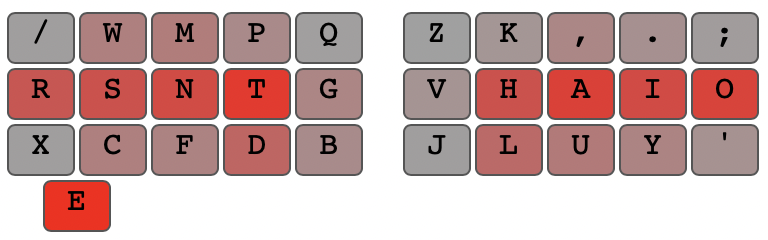

# Overview

The Adept keyboard layout is designed to maximize home-row use while minimizing pinky and inner-index use. Part of how we keep the same-finger-bigrams low and the home-row use high is by moving `e` to the thumb opposite of the one `space` is on. In this arrangement with vowels/punct on the right hand, `space` should be on the left thumb, and therefore `e` on the right.

In addition the frequency distribution for off-home-row keys is setup to emphasize the bottom row. 

```
/ w m p q  z k , . ;
r s n t g  v h a i o
x c f d b  j l u y '
           e
```


